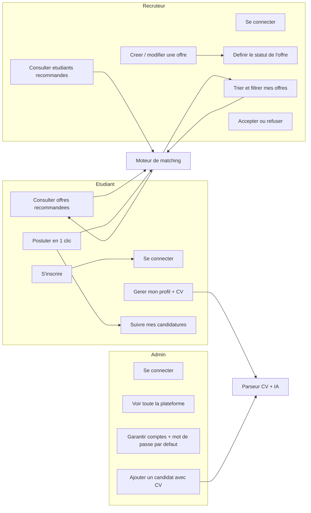
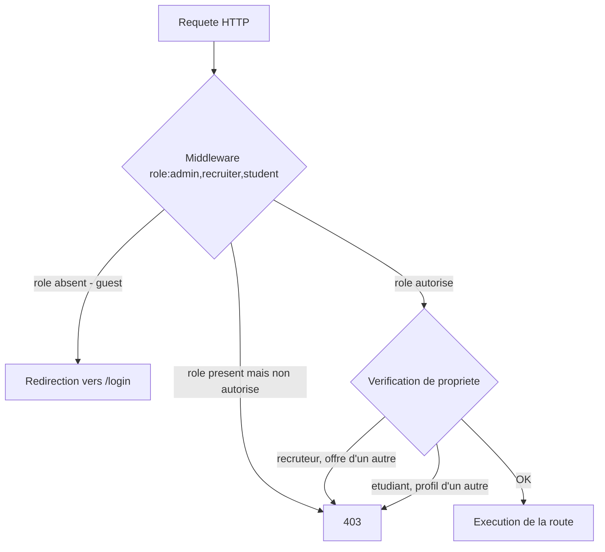
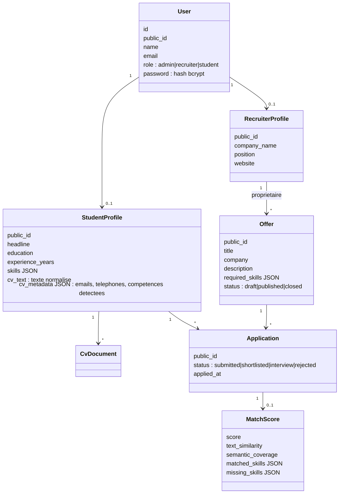
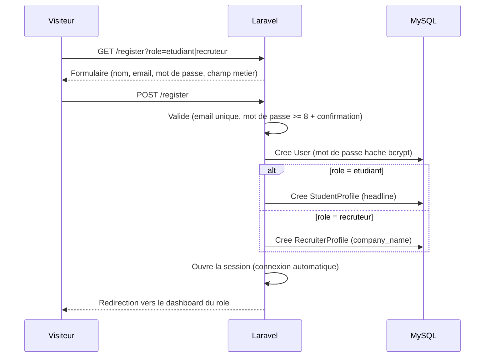
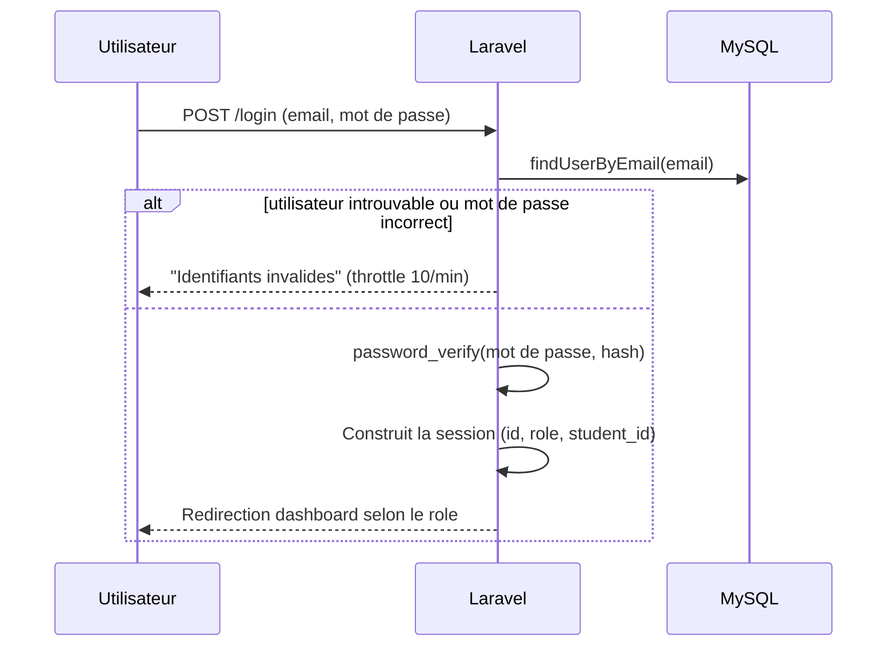
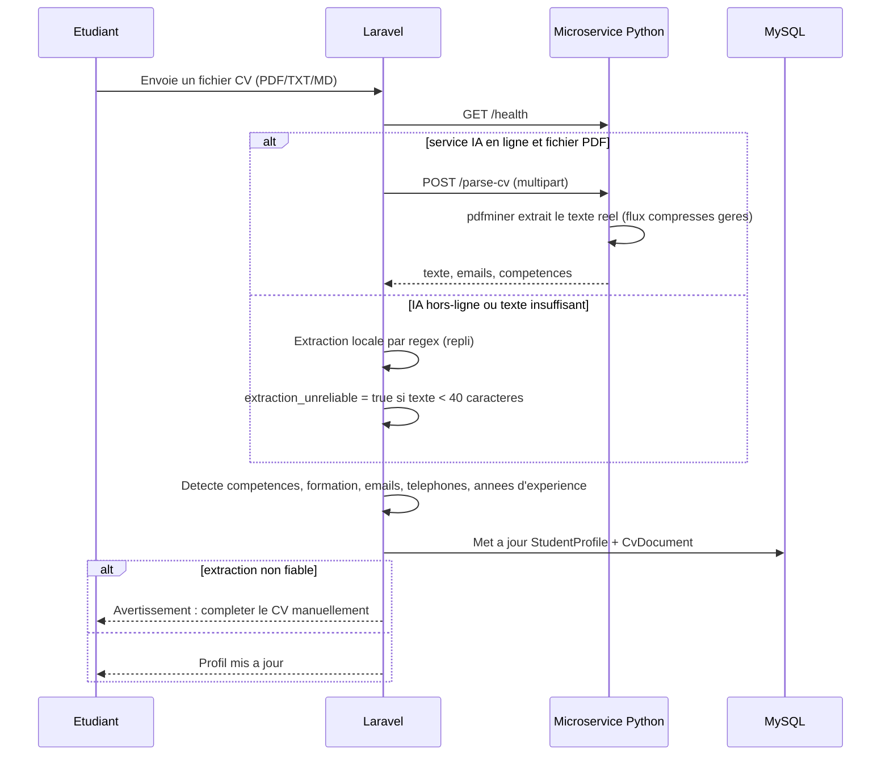
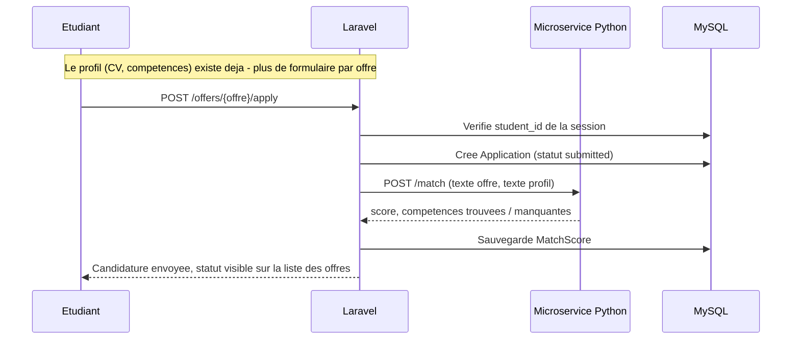
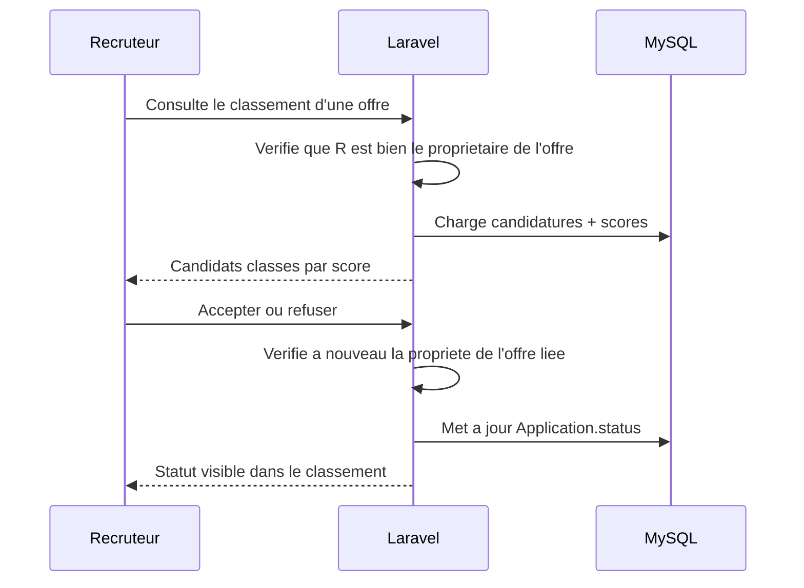
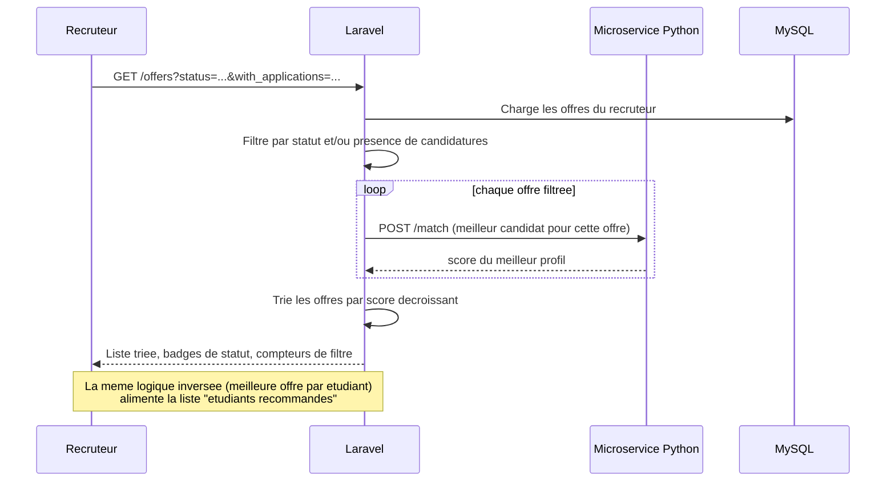
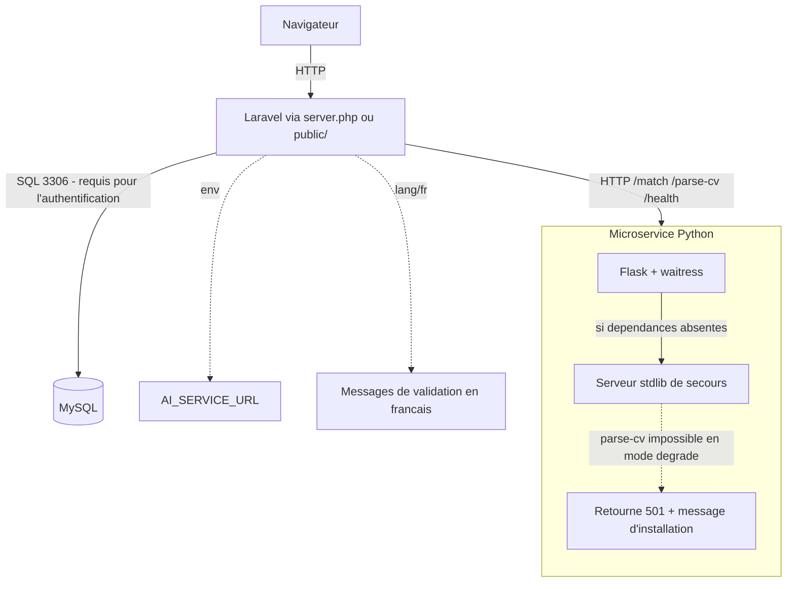

# UML Smart-Recruit

Diagrammes mis à jour pour refléter le contrôle d'accès par rôle, l'authentification réelle (email + mot de passe), l'extraction de CV robuste (IA + repli local), la candidature unifiée en un clic, et le tri/filtrage côté recruteur.

## Cas d'utilisation

**Changements par rapport à l'ancienne version** : l'étudiant s'inscrit et se connecte réellement (fini le sélecteur de rôle démo) ; il n'existe plus qu'un seul chemin de candidature (`Postuler en 1 clic`, qui réutilise le CV du profil) — l'ancien formulaire "postuler avec CV" par offre a été supprimé. Le recruteur gagne le tri/filtrage de ses offres et la mise en avant des étudiants compatibles.

## Contrôle d'accès par rôle

`EnsureRole` (middleware) gère le filtrage large par rôle ; les vérifications fines (un recruteur ne modifie que ses propres offres, un étudiant ne voit que son propre profil) restent faites en ligne dans chaque route via `sr_offer_owner_matches()`.

## Classes principales

Les champs `password`, `experience_years` et `status` (offre) sont désormais réellement exploités : mot de passe vérifié à la connexion, expérience saisissable ou déduite du CV, statut d'offre pilotable par le recruteur.

## Séquence : inscription

## Séquence : connexion

## Séquence : upload CV avec repli IA

Le microservice Python bascule lui-même sur un serveur de secours si Flask est absent ; ce mode dégradé refuse `/parse-cv` proprement (401/501) au lieu de planter sur un contenu binaire.

## Séquence : candidature en un clic

## Séquence : décision recruteur

## Séquence : tri et filtres côté recruteur

## Déploiement

`pip install -r ai-service/requirements.txt` installe Flask, pdfminer.six et waitress ; sans ces dépendances, le service reste fonctionnel pour `/health` et `/match` mais dégrade proprement `/parse-cv` plutôt que de planter.
